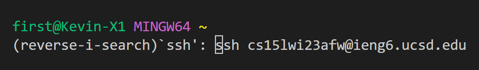
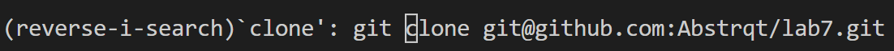
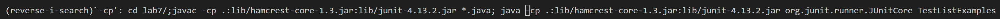
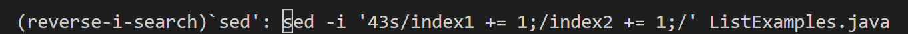
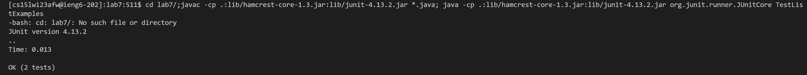
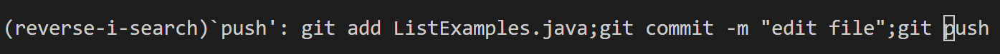

# Lab Report 4 - CSE Labs Done Quick

## Step 1: Log into ieng6


Keys pressed:
```console
first@Kevin-X1 MINGW64 ~
<^R>
(reverse-i-search)`<ssh>`: ssh cs15lwi23afw@ieng6.ucsd.edu <enter>
```
To log into my ieng6 account, I first pressed `Ctrl+R` to open the `reverse-i-search` prompt. This is because I had already ran the command `ssh cs15lwi23afw@ieng6.ucsd.edu` multiple times to log into my account. To find this command in my history, I then typed `ssh` into the `reverse-i-search` prompt and pressed `enter` to login. Note that I did not need to enter a password to access my account because I had a public SSH key specific to my machine for ieng6.

## Step 2: Clone your fork of the repository from the Github account


Keys pressed:
```console
<^R>
(reverse-i-search)`<clone>`: git clone git@github.com:Abstrqt/lab7.git <enter>
```
Once inside my ieng6 account, I pressed `Ctrl+R` again to open the `reverse-i-search` prompt. This is because I had already ran the command `git clone git@github.com:Abstrqt/lab7.git` multiple times to clone my fork of the repository. To find this command in my history, I then typed `clone` into the `reverse-i-search` prompt and pressed `enter` to clone. 

## Step 3: Run the tests, demonstrating that they fail


Keys pressed:
```console
<^R>
(reverse-i-search)`<-cp>`: cd lab7/;javac -cp .:lib/hamcrest-core-1.3.jar:lib/junit-4.13.2.jar *.java;
java -cp .:lib/hamcrest-core-1.3.jar:lib/junit-4.13.2.jar org.junit.runner.JUnitCore TestListExamples <enter>
```
When the repository is cloned, I pressed `Ctrl+R` again to open the `reverse-i-search` prompt. This is because I had already ran the command to run the tests multiple times. The command looks very scary at first, but it can actually be broken into 3 parts. The first command is `cd lab7/` which switches the current directory to `lab7`. The second command is `javac -cp .:lib/hamcrest-core-1.3.jar:lib/junit-4.13.2.jar *.java` which compiles all the `.java` files. The third command is `java -cp .:lib/hamcrest-core-1.3.jar:lib/junit-4.13.2.jar org.junit.runner.JUnitCore TestListExamples` which runs the JUnit tester class `TestListExamples.class`. These 3 commands are combined into one singular command using semicolons to seperate each command! To find this command in my history, I then typed `-cp` into the `reverse-i-search` prompt and pressed `enter` to run the command.

## Step 4: Edit the code file to fix the failing test


Keys pressed:
```console
<^R>
(reverse-i-search)`<sed>`: sed -i '43s/index1 += 1;/index2 += 1;/'  ListExamples.java <enter>
```
To fix `ListExamples.java` so that it passes the JUnit tests, I once again pressed `Ctrl+R` to open the `reverse-i-search` prompt. The `sed` command allows you to edit a file from command line and the `-i` flag allows you to change the file in-place, meaning it edits on top of the specified file. The `43s` specifies the line number I want to change, which is line 43. The `index1 += 1;` is the part of line 43 that I want to change and `index2 += 1;` is what I want it to be changed to. `ListExamples.java` specifies the file I want the `sed` command to be performed on. To find this command in my history, I then typed `sed` into the `reverse-i-search` prompt and pressed `enter` to run the command. 

## Step 5: Run the tests, demonstrating that they now succeed



Keys pressed:
```console
<^R>
(reverse-i-search)`<-cp>`: cd lab7/;javac -cp .:lib/hamcrest-core-1.3.jar:lib/junit-4.13.2.jar *.java;
java -cp .:lib/hamcrest-core-1.3.jar:lib/junit-4.13.2.jar org.junit.runner.JUnitCore TestListExamples <enter>
```
When the file is edited, I pressed `Ctrl+R` again to open the `reverse-i-search` prompt. To find the command that runs the tests in my history, I then typed `-cp` into the `reverse-i-search` prompt and pressed `enter` to run the command. Note that this is the same command that was run in step 3. This command still works even though we are already in the `lab7` directory because the semicolons run each command sequentially, even if the previous command fails. If the commands were joined with `&&`, this command may not work. 

## Step 6: Commit and push the resulting change to your Github account 


Keys pressed:
```console
(reverse-i-search)`<push>`: git add ListExamples.java;git commit -m "edit file";git push
```
To commit and push the resulting change to my Github account, I pressed `Ctrl+R` once again to open the `reverse-i-search` prompt. To find the command that commits and pushes the changes in my history, I then typed `push` into the `reverse-i-search` prompt and pressed `enter` to run the command. This command could also be split into 3 parts. The first part `git add ListExamples.java` adds `ListExamples.java` to the staging area. The second part `git commit -m "edit file"` makes a new commit with the message "edit file". The last part `git push` pushes the commit to my Github repository. These three commands are seperated by semicolons to make one singular command.
