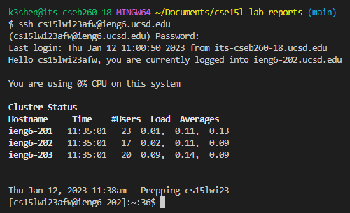

# Lab Report 1 - Remote Access

## Step 1: Installing VScode
Install [VScode](https://code.visualstudio.com/) by following the instructions for your operating system and open a new VScode window. 

It should look something like this:
 

## Step 2: Remotely Connecting
Install [Git](https://git-scm.com/) for your machine, which includes git and git bash. Next, open the terminal for VScode using (Ctrl or Command + `, or use the Terminal → New Terminal menu option). 
Then, create a new bash instance
 
Then, login to your course-specific account using the following command:
```bash
$ ssh cs15lwi23xxx@ieng6.ucsd.edu
```
Your command will look something similar except the xxx should be replaced by the letters in your course-specific account. For example, in my case the command would be 
```bash 
$ ssh cs15lwi23afw@ieng6.ucsd.edu
```
Note that the $ symbol in the command should not be included when typing the command and that it is only there for convention. 
If the following message appears, just type yes and press enter. 
```bash
$ ssh cs15lwi23afw@ieng6.ucsd.edu
The authenticity of host 'ieng6.ucsd.edu (128.54.70.227)' can't be established.
RSA key fingerprint is SHA256:ksruYwhnYH+sySHnHAtLUHngrPEyZTDl/1x99wUQcec.
Are you sure you want to continue connecting (yes/no/[fingerprint])? 
```
Enter your password and you should be logged in!
 

## Step 3: Trying Some Commands
Time to try some commands!

Here are some useful commands to try:
* `cd ~`
* `cd [dir]`
* `ls -lat`
* `ls -a`
* `ls <dir>`
* `pwd`
* `cp /home/linux/ieng6/cs15lwi23/public/hello.txt ~/`
* `cat /home/linux/ieng6/cs15lwi23/public/hello.txt`

These are some of the commands I used: 
 
The first command copies the hello.txt file from /home/linux/ieng6/cs15lwi23/public/hello.txt into my home directory. The second command lists out the files in my home directory and the third command prints out the contents of hello.txt. The last command sets the working directory to /home/linux/ieng6/cs15lwi23/