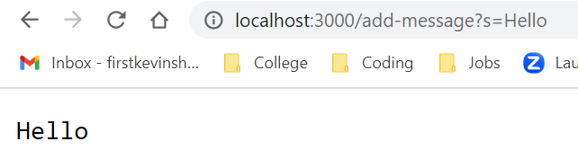
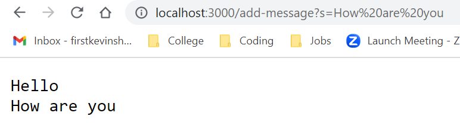
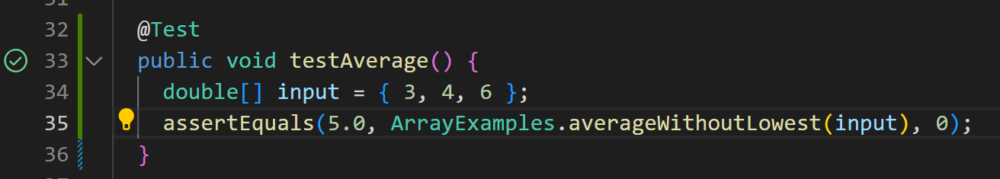
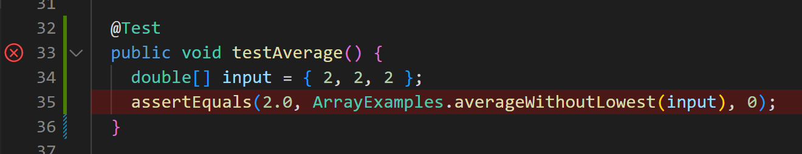
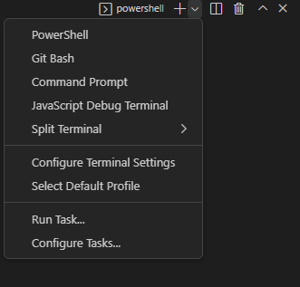
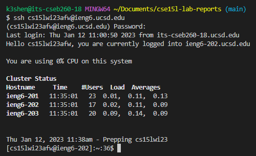

# Lab Report 2 - Servers and Bugs

## Part 1: Creating StringServer
For the creation of the web server StringServer, I used the Server.java  file provided to me during the lab and created my own file called StringServer.java. The contents of each file are displayed below: 

```java
// Server.java: A simple web server using Java's built-in HttpServer

// Examples from https://dzone.com/articles/simple-http-server-in-java were useful references

import java.io.IOException;
import java.io.OutputStream;
import java.net.InetSocketAddress;
import java.net.URI;

import com.sun.net.httpserver.HttpExchange;
import com.sun.net.httpserver.HttpHandler;
import com.sun.net.httpserver.HttpServer;

interface URLHandler {
    String handleRequest(URI url);
}

class ServerHttpHandler implements HttpHandler {
    URLHandler handler;
    ServerHttpHandler(URLHandler handler) {
      this.handler = handler;
    }
    public void handle(final HttpExchange exchange) throws IOException {
        // form return body after being handled by program
        try {
            String ret = handler.handleRequest(exchange.getRequestURI());
            // form the return string and write it on the browser
            exchange.sendResponseHeaders(200, ret.getBytes().length);
            OutputStream os = exchange.getResponseBody();
            os.write(ret.getBytes());
            os.close();
        } catch(Exception e) {
            String response = e.toString();
            exchange.sendResponseHeaders(500, response.getBytes().length);
            OutputStream os = exchange.getResponseBody();
            os.write(response.getBytes());
            os.close();
        }
    }
}

public class Server {
    public static void start(int port, URLHandler handler) throws IOException {
        HttpServer server = HttpServer.create(new InetSocketAddress(port), 0);

        //create request entrypoint
        server.createContext("/", new ServerHttpHandler(handler));

        //start the server
        server.start();
        System.out.println("Server Started! Visit http://localhost:" + port + " to visit.");
    }
}
```

```java
// StringServer.java 

import java.io.IOException;
import java.net.URI;

class Handler implements URLHandler {
    // The one bit of state on the server: a number that will be manipulated by
    // various requests.
    String message = "";

    public String handleRequest(URI url) {
        if (url.getPath().equals("/")) {
            return message;
        }
        else if (url.getPath().contains("/add-message")) {
            String[] parameters = url.getQuery().split("=");
            if (parameters[0].equals("s")) {
                message += parameters[1] + "\n";
                return message;
            }
            return "Invalid Path!";
        }
        else {
            return "404 Not Found!";
        }
    }
}

class StringServer {
    public static void main(String[] args) throws IOException {
        if(args.length == 0){
            System.out.println("Missing port number! Try any number between 1024 to 49151");
            return;
        }

        int port = Integer.parseInt(args[0]);

        Server.start(port, new Handler());
    }
}
```

In my StringServer.java file, I implement the interface URLHandler provided in Server.java. This handles all incoming `HTTP GET` requests and defines possible endpoints to retrieve information from. In my `handleRequest` method, I define two endpoints: the base endpoint `/` and an add-message endpoint `/add-message?s=[message]`. The base endpoint command displays the entire message and the add-message command adds a new message to the next line of all messages. The `StringServer` class contains the main method which starts the server when called. To start the server, compile both files using `javac` and run the server using `java Main PORT`.

```console
first@Kevin-X1 MINGW64 ~/OneDrive/Documents/_UCSD/CSE 15L/stringserver
$ javac *.java

first@Kevin-X1 MINGW64 ~/OneDrive/Documents/_UCSD/CSE 15L/stringserver
$ java StringServer 3000
Server Started! Visit http://localhost:3000 to visit.
```

Once the server is started, try out some commands!


In this `HTTP GET` request, the `handleRequest` method is called with the url argument `http://localhost:3000/add-message?s=Hello`. In this url, `http://` defines the scheme, `localhost:3000` defines the domain, `/add-message` defines the path, and `?s=Hello` defines the query. We are only interested in the values of the path and query. The path matches the `else-if` condition of our method and the query parameter is identified as `Hello`. The query parameter is added to the next line of all messages. 



In this `HTTP GET` request, the `handleRequest` method is called with the url argument `http://localhost:3000/add-message?s=How are you`. In this url, `http://` defines the scheme, `localhost:3000` defines the domain, `/add-message` defines the path, and `?s=How are you` defines the query. We are only interested in the values of the path and query. The path matches the `else-if` condition of our method and is the same as our previous request. Now, take a look at the url after the request: `http://localhost:3000/add-message?s=How%20are%20you`. Since urls cannot contain spaces, the spaces are converted into special url encoded characters, which in this case are `%20`. The query parameter is identified as `How are you` and is added to the next line of all messages. 

## Part 2: Finding Bugs
One bug I identified in the lab was with the method `averageWithoutLowest`. Below is the method without any alterations. 
```java
static double averageWithoutLowest(double[] arr) {
	if(arr.length < 2) { return 0.0; }
	double lowest = arr[0];
	for(double num: arr) {
		if(num < lowest) { lowest = num; }
	}
	double sum = 0;
	for(double num: arr) {
		if(num != lowest) { sum += num; }
	}
	return sum / (arr.length - 1);
}
```
I discovered the bug after testing the method several times using JUnit. At first the method seemed to be working as shown with the following test:
```java
@Test
public void testAverage() {
	double[] input = { 3, 4, 6 };
	assertEquals(5.0, ArrayExamples.averageWithoutLowest(input), 0);
}
```


The following test expects `5.0` as an output from the method and the actual output was indeed `5.0`. However upon further inspection, the method did not pass certain edge cases:
```java
@Test
public void testAverage() {
	double[] input = { 2, 2, 2 };
	assertEquals(2.0, ArrayExamples.averageWithoutLowest(input), 0);
}
```


In this test case, the expected output was `2.0` but the actual output was `0.0`. The symptom of this bug is a wrong answer because the expected output doesn't match the actual output. This bug was caused by the program adding all the numbers that don't equal to the lowest number. As a result, the sum of the array was `0.0`. This is wrong because the sum should be `4.0` and the average should be `2.0` because `4.0/2 = 2.0`. A fix to this program could be: 

```java
static double averageWithoutLowest(double[] arr) {
	if(arr.length < 2) { return 0.0; }
	double lowest = arr[0];
	for(double num: arr) {
		if(num < lowest) { lowest = num; }
	}
	double sum = 0;
	for(double num: arr) {
		sum += num;
	}
	return (sum-lowest) / (arr.length - 1);
}
```


Install [Git](https://git-scm.com/) for your machine, which includes git and git bash. Next, open the terminal for VScode using (Ctrl or Command + `, or use the Terminal → New Terminal menu option). 
Then, create a new bash instance. 

 

Then, login to your course-specific account using the following command:
```bash
$ ssh cs15lwi23xxx@ieng6.ucsd.edu
```
Your command will look something similar except the xxx should be replaced by the letters in your course-specific account. For example, in my case the command would be 
```bash 
$ ssh cs15lwi23afw@ieng6.ucsd.edu
```
Note that the $ symbol in the command should not be included when typing the command and that it is only there for convention. 
If the following message appears, just type yes and press enter. 
```
The authenticity of host 'ieng6.ucsd.edu (128.54.70.227)' can't be established.
RSA key fingerprint is SHA256:ksruYwhnYH+sySHnHAtLUHngrPEyZTDl/1x99wUQcec.
Are you sure you want to continue connecting (yes/no/[fingerprint])? 
```
Enter your password and you should be logged in!

 

## Part 3: Week 2 and 3 Reflection
